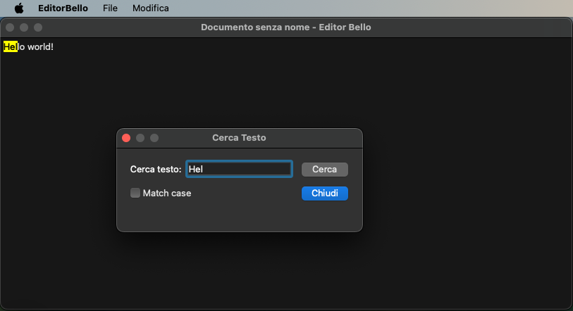

In this repository there is the code i wrote for my C++ final exam.

There are two subprojects:

1. A very simple implementation of a sparse matrix, featuring the integration of standard iterators
2. A Qt text editor with basic features, such as text search and file management.

